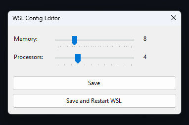

# WSLConfigManager

WSLConfigManager is a lightweight Windows status bar application that allows users to easily manage the properties of their WSL 2 configuration file (`.wslconfig`).

## Features

- Easy-to-use GUI for managing WSL 2 configuration
- Adjust memory limit and number of virtual processors
- Monitor and apply changes without manually editing the `.wslconfig` file
- Automatically restart WSL instances after saving changes
- Single executable with no additional dependencies

## Installation

1. Download the latest release of WSLConfigManager from the [Releases](https://github.com/yourusername/WSLConfigManager/releases) page.
2. Extract the `WSLConfigManager.exe` file from the downloaded archive.
3. Run `WSLConfigManager.exe`. The application will appear in the Windows status bar.

## Usage

1. Right-click the WSLConfigManager icon in the Windows status bar to open the context menu.
2. Click "Open Config" to launch the configuration window.
3. Adjust the settings using the provided sliders and text fields.
4. Click "Save" to apply your changes and restart any running WSL instances.

## Contributing

If you'd like to contribute to WSLConfigManager, please [fork the repository](https://github.com/yourusername/WSLConfigManager/fork) and submit a pull request with your changes. Please follow standard GitHub contribution guidelines and be sure to thoroughly test your changes before submitting.

## License

WSLConfigManager is released under the [MIT License](LICENSE).
